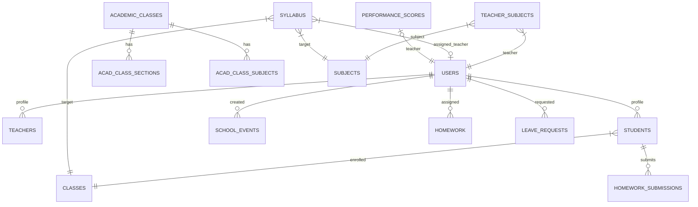

# DATABASE DOCUMENTATION - SAMS ATLAS PLATFORM

## 1. Overview
The database for the SAMS ATLAS Platform is a MySQL relational database managed via Prisma ORM (`prisma/schema.prisma`). It enforces strict relationships, cascading deletes, and provides a highly normalized structure for handling users, academic architecture, and LMS operations.

## 2. ER Diagram (Conceptual)

## 3. Data Dictionary

### Core User & Identity Management
#### `users`
**Purpose:** Core authentication and identity table for all entities (Admin, Teachers).
* `id` (Int, PK, AutoInc)
* `name` (VarChar 100)
* `email` (VarChar 100, Unique)
* `password` (VarChar 255)
* `role` (Enum: admin, teacher)
* `phone` (VarChar 20, Nullable)
* `status` (Enum: active, inactive)

**Relationships:**
* 1:1 with `teachers` (teacher profile)
* 1:1 with `performance_scores`

#### `teachers`
**Purpose:** Extended profile details specifically for teachers.
* `id` (Int, PK)
* `user_id` (Int, FK -> users.id, Unique)
* `mobile` / `dob` / `qualification` / `experience` / `salary` / `subject` (Strings)

#### `students`
**Purpose:** Student profiles and enrollment records.
* `id` (Int, PK)
* `name`, `roll_no`, `email`
* `class_id` (Int, FK -> classes.id)
* `status` (Enum: Active, Blocked, Graduated, Failed)
* Various profile fields (father_name, mobile, address, gender)

### Academic Architecture (Core Taxonomy)
#### `academic_classes`
**Purpose:** Standalone class definitions (e.g., Grade 1, Grade 10).
* `id`, `name`, `class_number`, `sort_order`, `class_category`

#### `acad_sections`
**Purpose:** Standalone section definitions (e.g., Section A, Section B).
* `id`, `name`, `code`

#### `subjects`
**Purpose:** Global subject taxonomy (e.g., Mathematics, Science).
* `id`, `name`, `code`

#### `streams`
**Purpose:** Stream groupings (e.g., Science, Commerce) for higher grades.
* `id`, `name`, `code`

### Assignments & Mappings
#### `acad_class_sections` & `acad_class_subjects`
**Purpose:** Mapping tables that link classes with sections, subjects, and optionally streams.

#### `teacher_subjects`
**Purpose:** Links a teacher to a specific subject and class. (Teacher assignment logic).
* `teacher_id`, `subject_id`, `class_id`

### LMS & Academic Execution
#### `syllabus` & `syllabus_plan`
**Purpose:** Tracks weekly/topic-level syllabus execution.
* `class_id`, `subject_id`, `teacher_id`
* `chapter`, `topic`, `week`
* `is_completed`, `status`
* `learning_outcome`, `notebook_checked`

#### `homework` & `homework_submissions`
**Purpose:** Manages assigned homework and student responses.
* `homework`: Assigned by teacher (`teacher_id`), linked to `class_id`, `subject_id`.
* `homework_submissions`: `homework_id`, `student_id`, `status` (submitted, pending, late), `score`.

#### `teacher_timetable` & `time_slots`
**Purpose:** Manages the school timetable grid.
* `time_slots`: Master list of periods (start_time, end_time, is_break).
* `teacher_timetable`: Maps a `teacher`, `class`, `section`, `subject`, and `time_slot` to a `day_of_week`.

### Assessment & Performance
#### `learning_outcomes` & `teacher_performance_lo`
**Purpose:** Tracks Learning Outcome (LO) scores given by teachers to students, and by Principal to Teachers.
* `teacher_score`, `principal_score`, `status` (Approaching, Meeting, Exceeding).

#### `observations` & `class_observations`
**Purpose:** Stores classroom observation audits by the Principal.
* Tracks specific metrics: `content_mastery`, `pedagogy`, `student_engagement`, etc.

#### `performance_scores`
**Purpose:** Pre-calculated overall KPI metrics for teachers.
* `syllabus_completion_pct` (15% weight)
* `lo_avg_pct` (15% weight)
* `observation_pct` (25% weight)
* `other_score` (20% weight + 10% participate)
* `overall_score` (Final calculated metric)

### Operational Management
#### `school_events` & `event_participants` & `event_winners`
**Purpose:** Event and competition tracking.
* `title`, `event_date`, `event_type` (school, class, competition).
* Tracks participants and positions (first, second, third).

#### `leave_requests`
**Purpose:** Teacher leave applications.
* `user_id`, `type`, `from_date`, `to_date`, `reason`, `status` (Pending, Approved, Rejected).

## 4. Dependencies & Cascades
* Most foreign keys implement `ON DELETE CASCADE`. Removing a `class` will delete all its `students`, `syllabus`, and `homework`.
* Removing a `user` (teacher) will cascade and delete their `teacher_subjects`, `leave_requests`, and `teacher_profile`.
* `school_events.created_by` uses `ON DELETE SET NULL` to preserve historical events if an admin is deleted.
